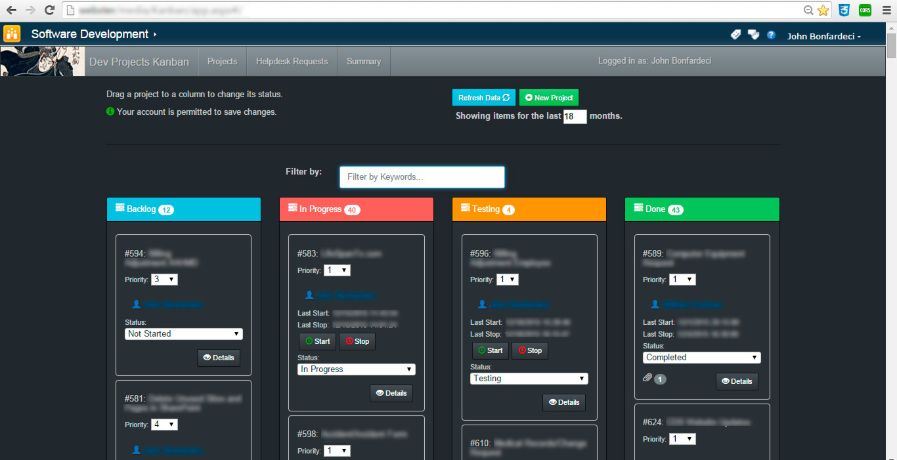
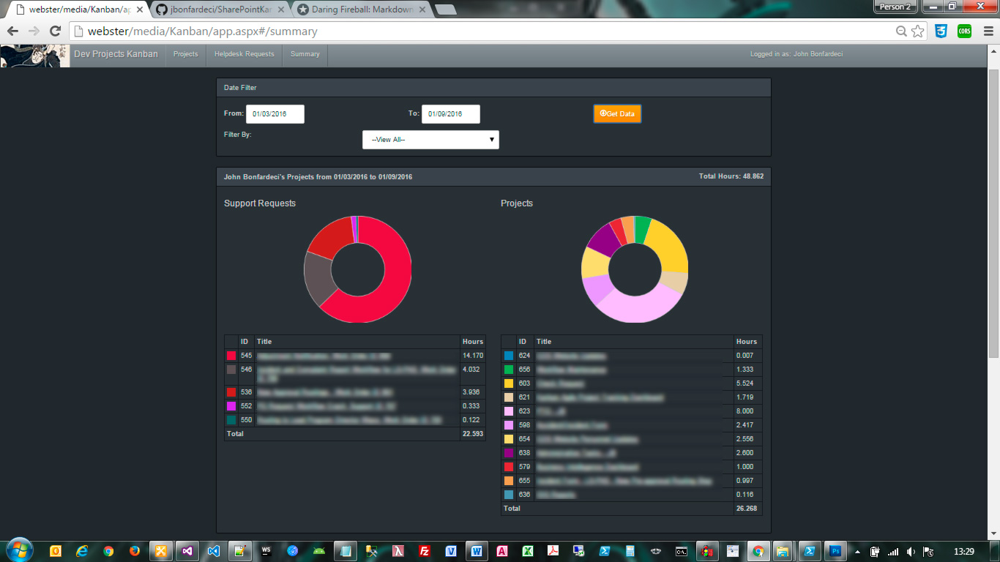
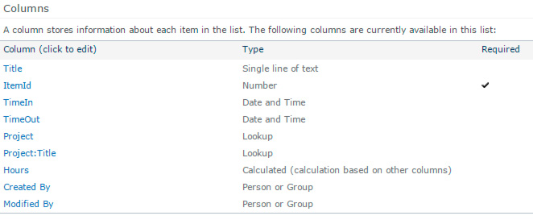
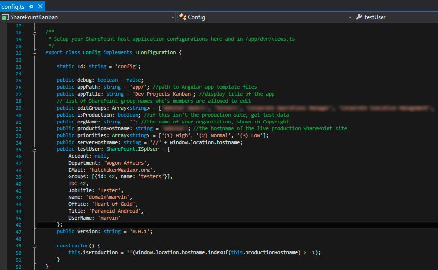
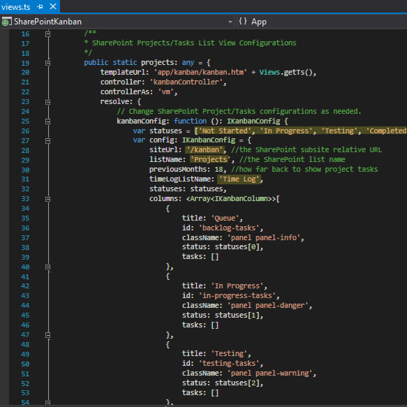
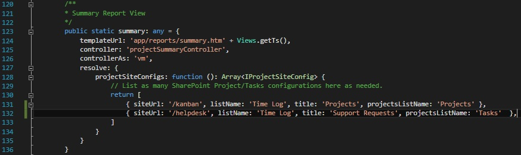
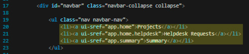

# Kanban for SharePoint 2010
(2013 Compatibility In Progress)

##An Agile Kanban "signboard" application for SharePoint built on Angular JS.

By adding this Angular application to any of your SharePoint sites, you can turn any SharePoint list, of content type Projects or Tasks, into your own Agile Kanban dashboard. 

"Kanban" is a Japanese term for a signboard or billboard and was first developed by Taiichi Ohno at the Toyota Corporation and used to manage production schedules. To learn more about Kanban boards, their history and uses, see https://en.wikipedia.org/wiki/Kanban and http://kanbanblog.com/explained/.

A Kanban configuration usually includes at least several columns and can be as simple as sticky notes on a whiteboard or as sophisticated as drag-and-drop software application that all members of your team interact with. Each column represents the status of the projects within the column. Column names vary but traditionally they include: Backlog, In Progress, Testing, Done/Complete. When the status of a project changes, one simply moves the notecard to the next column. 

If you've been using Task or Projects lists in SharePoint for any amount of time, you know there are task statuses in the Status field of each list item: Not Started, In Progress, Completed, Waiting on someone else, and Deferred. We can transform this list and its existing list items into the Kanban format. By doing so, you can transform your basic and unintuitive stock list view into a powerful visual and interactive tool, that will increase the productivity of your team members. 




The default application configuration includes a report view to track the hours logged by your team members. The report 
groups hours logged by team member, project title, and aggregates the total hours for each project within the selected date range. 
A doughnut chart is displayed for each project list which allows management to quickly guage the percentages of time spent on each project. 


##Requirements
 * At least one SharePoint Tasks or Projects List of Content Type, Tasks
 * ADD 2 additional columns
  * LastTimeIn (Date and Time)
  * LastTimeOut (Date and Time)
 * If you need a status for "Testing", append "Testing" to the Column choices for Status in the List Settings.

* If you wish to track hours logged, add a custom SharePoint list titled "Time Log" with the following columns:
 * Title (Single line of text)
 * TimeIn (Date and Time)
 * TimeOut (Date and Time)
 * Project (Lookup) - a lookup column to your poject list displaying the ID field of the project.
 * Project:Title	(Lookup) - a lookup column to your poject list displaying the Title field of the project.	
 * Hours (Calculated) - the formula to calculate hours (TimeOut minus TimeIn) is: `=IF(NOT(ISBLANK(TimeOut)),(TimeOut-TimeIn)*24,0)`	


		
##Application Configuration
In /app/config.ts, update these configuration variables:
```
	public appTitle: string = 'My Kanban Title'; // the display title on your Kanban board
	public editGroups: Array<string> = ['']; //add SharePoint group names that are allowed to save changes to projects
	public productionHostname: string = 'the NAME of your sharepoint site'; // e.g. if your SP site URL is https://mysite, the name is 'mysite'
```


##Angular UI-Router View Configuration
In /app/dvr/views.ts, update these list configurations:
```
	siteUrl: '/<mysite relative URL>', //the SharePoint subsite relative URL, e.g. '/mysubsite'
	listName: '<my list name>', //the SharePoint list name,e.g. will usually be "Projects", "Tasks", or "Workflow Tasks"
	previousMonths: 18, //how far back to show project tasksdefault is 18
	timeLogListName: 'Time Log', // the list name of your time log list. Default is "Time Log" - YOU'LL NEED TO CREATE THIS
```


###Configure the Report 
Edit /app/dvr/views.ts



##Configure the Menu
Open /app/menu/menu.htm, and change the menu titles and Angular UI links, with the attribute `ui-sref`, to match your route names in /app/dvr/routes.ts



###When Configuration is Complete
 - Build the Visual Studio Application 
 - Publish to the /staging directory
 - Minify the `app.js` file in the /staging directory
 - Copy: /staging/app, /staging/app.js, /staging/app.min.js, and /staging/scripts to a Document Library on a SharePoint site.
 


